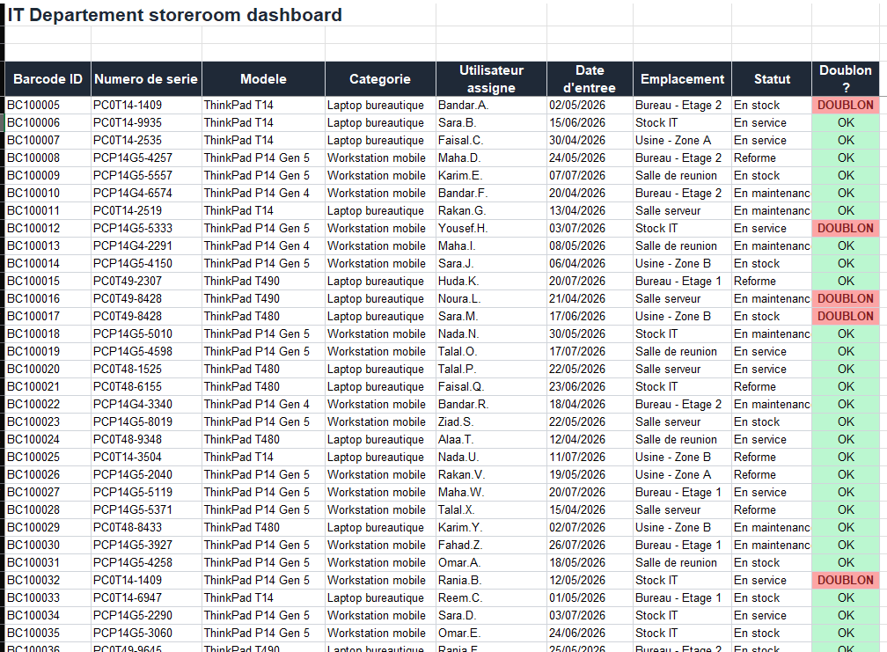
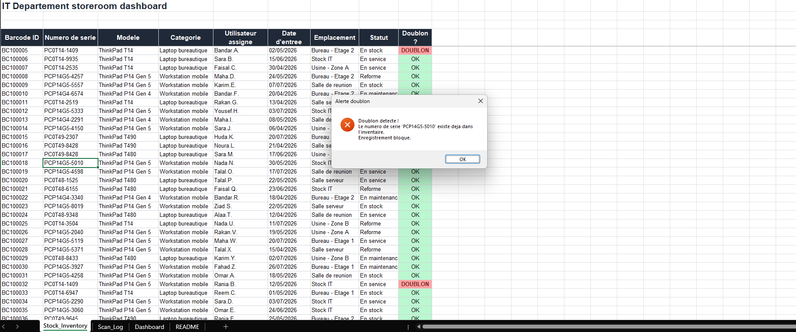
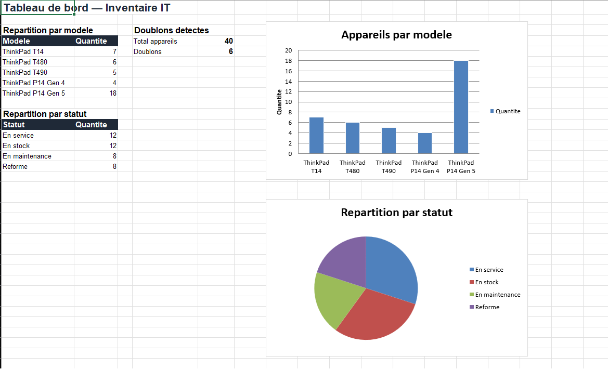

# 📦 IT Stock Management — Barcode & Duplicate Detection


Prototype d'un système de gestion de stock informatique développé pendant mon stage IT
(avril–juillet 2026) chez un industriel du secteur agroalimentaire. Reconstruit ici avec des
**données fictives** pour des raisons de confidentialité.

## 📋 Sommaire

- [Contexte](#-contexte)
- [Fonctionnalités](#-fonctionnalités)
- [Stack technique](#-stack-technique)
- [Structure du repo](#-structure-du-repo)
- [Aperçu](#-aperçu)
- [Installation & utilisation](#-installation--utilisation)
- [Confidentialité](#-confidentialité)

## 🎯 Contexte

Dans le cadre d'un projet de rénovation d'espaces de travail (~35 bureaux), le suivi du
matériel informatique (laptops, workstations) était devenu difficile à gérer avec les
méthodes existantes : mouvements d'équipements non tracés, recherches de matériel
chronophages, risque d'erreurs manuelles.

## ✨ Fonctionnalités

- 🔍 **Scan par code-barres** pour identifier chaque équipement
- ⚙️ **Macro VBA** qui enregistre automatiquement l'entrée/sortie du matériel
- 🚫 **Détection automatique des doublons** basée sur le numéro de série
- 📊 **Dashboard** intégré (répartition par modèle, par statut)
- 📝 **Journal d'activité** (Scan_Log) horodaté

## 🛠 Stack technique

| Composant | Usage |
|---|---|
| Excel | Base de données / interface |
| VBA | Logique métier (scan, validation, journalisation) |
| `COUNTIF` | Détection de doublons en temps réel |
| Mise en forme conditionnelle | Alertes visuelles (OK / DOUBLON) |

## 📁 Structure du repo

```
├── Stock_Management_Prototype.xlsm   # Classeur avec macro (inventaire, journal, dashboard)
├── Module_BarcodeScan.bas            # Code VBA source (scan + détection de doublons)
├── screenshots/
│   ├── inventory.png                 # Vue Stock_Inventory
│   ├── duplicate-alert.png           # Alerte de doublon en action
│   └── dashboard.png                 # Dashboard / graphiques
└── README.md
```

## 🖼 Aperçu

| Inventaire | Alerte doublon | Dashboard |
|---|---|---|
|  |  |  |

## 🚀 Installation & utilisation

1. Ouvrir `Stock_Management_Prototype.xlsm` dans Excel et activer les macros
2. `Alt+F8` → sélectionner `ScanBarcode` → **Exécuter**
3. Saisir un code-barres puis un numéro de série
4. Le système enregistre automatiquement le matériel, ou bloque l'opération et alerte en cas
   de doublon

Le code source du macro est aussi disponible séparément dans
[`Module_BarcodeScan.bas`](./Module_BarcodeScan.bas), importable via l'éditeur VBA
(`Alt+F11` → `Fichier` → `Importer un fichier`).

## 🔒 Confidentialité

⚠️ Ce dépôt ne contient **aucune donnée réelle** de l'entreprise d'accueil (noms, numéros de
série, emplacements). Toutes les valeurs ont été générées fictivement, en respectant la
structure et la logique des informations utilisées en entreprise, à titre de démonstration.

📌 L'ensemble du contenu (interface originale, données, documentation) a été traduit de
l'anglais vers le français pour ce dépôt.

---

*Projet réalisé dans le cadre d'un stage — ECE Paris, Cycle Bachelor.*
